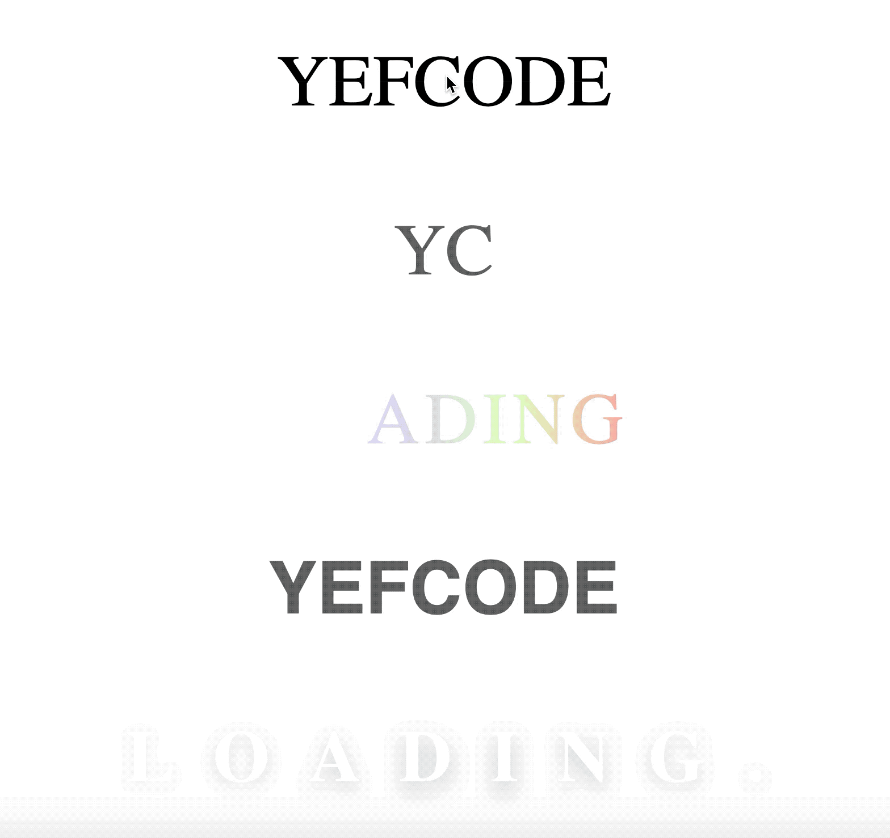

# css-effects-split-text-hover

> **#flex** | **#background: linear-gradient** | **#animation** | **@keyframes animate** | **#transform: translateY() scaleY()** | **#scss variables** | **transition** | **#clip-path: polygon** | **overflow** | **content: attr(data-text)** | **scss @for**

# Demo

